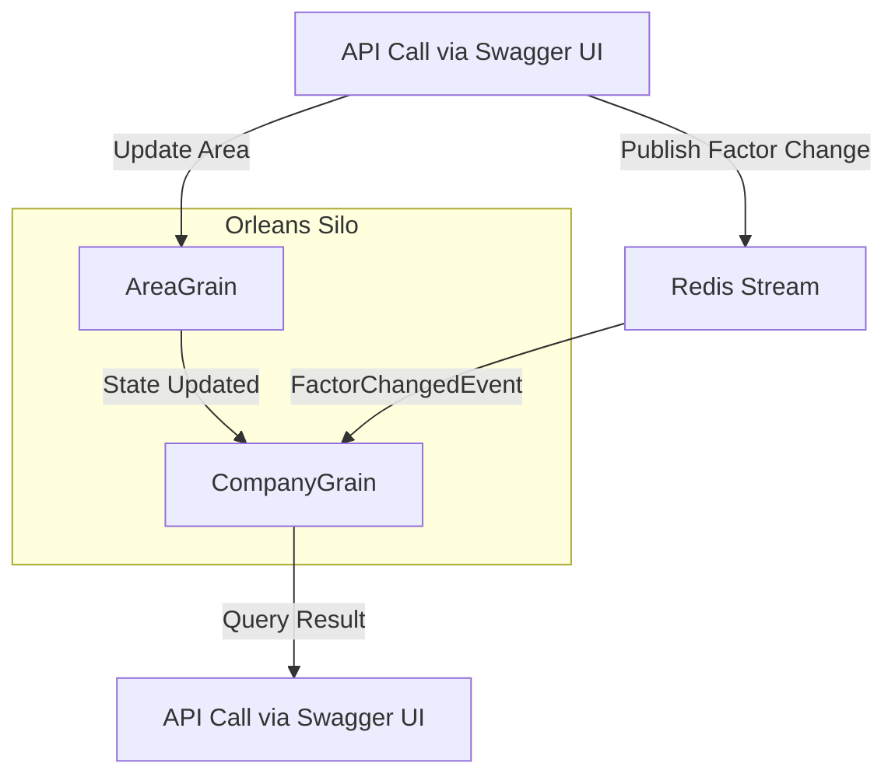

# orleans-notification-sample
Sample C# project to create a notification system with Orleans

## Overview

This project demonstrates a simple notification system built with [Microsoft Orleans](https://dotnet.github.io/orleans/), a cross-platform framework for building distributed applications with .NET. The sample showcases how to use Orleans grains to send and receive notifications in a scalable and reliable way.

## Features

- Orleans Silo and Client setup
- Notification grain interface and implementation
- Example of sending and receiving notifications
- **Swagger/OpenAPI UI for testing the API endpoints**

## Getting Started

### Prerequisites

- [.NET 9 SDK](https://dotnet.microsoft.com/download)
- Visual Studio 2022 or later (optional)

### Running the Sample

1. Clone the repository:
    ```bash
    git clone https://github.com/joelsodias/orleans-notifier-sample.git
    cd orleans-notifier-sample
    ```

2. Build the solution:
    ```bash
    dotnet build
    ```

3. Run the Orleans Silo (host):
    ```bash
    dotnet run --project SiloHost
    ```

4. In a new terminal, run the client (API server):
    ```bash
    dotnet run --project Client
    ```

5. Open your browser and navigate to `http://localhost:5000/swagger` (or the port shown in the terminal) to access the Swagger UI and interact with the API endpoints for sending and receiving notifications.

## Demonstrating the PubSub Chain of Events

Follow these steps to see Orleans Streams (PubSub) in action:

1. **Start the Orleans Silo**

    Run the SiloHost project:
    ```bash
    dotnet run --project SiloHost
    ```
    This starts the Orleans cluster and configures Redis streaming.

2. **Start the Client (API Server)**

    In a new terminal, run:
    ```bash
    dotnet run --project Client
    ```
    This launches the ASP.NET Core Web API, exposing endpoints for grains and streams.

3. **Open Swagger UI**

    Go to `http://localhost:5000/swagger` in your browser to access the API documentation and test endpoints.

4. **Demonstrate the PubSub Flow**

    - **a. Update an Area’s Operation**
      - Use `POST /api/company/{companyId}/area/{areaId}/update` in Swagger.
      - Example: `companyId=acme`, `areaId=north`, `hours=10`, `amount=1000`.
      - This updates the AreaGrain state.

    - **b. Publish a Factor Change Event**
      - Use `POST /api/company/{companyId}/factor` in Swagger.
      - Example: `companyId=acme`, `factor=1.2`.
      - This publishes a `FactorChangedEvent` to the Redis stream using Orleans Streams.

    - **c. Observe Grain Reaction**
      - Grains (such as CompanyGrain) subscribed to the stream receive the event and update their state or trigger further processing.

    - **d. Query the Result**
      - Use `GET /api/company/operational/result?companyId=acme` in Swagger.
      - This retrieves the latest computed result from the CompanyGrain.

5. **Summary of the PubSub Chain**

    1. API call updates grain state or publishes to stream.
    2. Grain processes the update.
    3. Event is published to Redis via Orleans Streams.
    4. Subscribed grain receives the event and reacts.
    5. API call retrieves the updated state/result from the grain.

This sequence demonstrates the full PubSub chain using Orleans Streams and Redis, with all interactions visible via the Swagger UI.

## Visual Overview

Below is a diagram illustrating the flow of events and data in the Orleans PubSub sample:



**Legend:**

- **API Call via Swagger UI**: User interacts with the API endpoints using Swagger UI.
- **AreaGrain**: Receives area updates from the API.
- **Redis Stream**: Used for publishing/subscribing to events (PubSub).
- **CompanyGrain**: Subscribes to the stream, reacts to events, and updates its state.
- **Query Result**: User queries the latest result from the grain via the API.

This diagram shows how API calls trigger grain updates and events, which are then processed and can be queried back through the API.

## Project Structure

- `Contracts`  
  Contains the grain interfaces and data contracts shared between the client and the silo.

- `Grains`  
  Implements the grain logic, including business logic for sending, storing, and delivering notifications.

- `SiloHost`  
  Hosts the Orleans Silo, managing the lifecycle of grains and handling client requests.

- `Client`  
  ASP.NET Core Web API project acting as a client to the Orleans cluster, exposing endpoints for sending notifications and querying results. The UI is provided via Swagger/OpenAPI.

- `Common`  
  Shared utilities and configuration extensions used across projects.

- `Orleans.Streaming.Redis`  
  Custom Orleans streaming provider implementation for Redis.

## License

This project is licensed under the MIT License.
